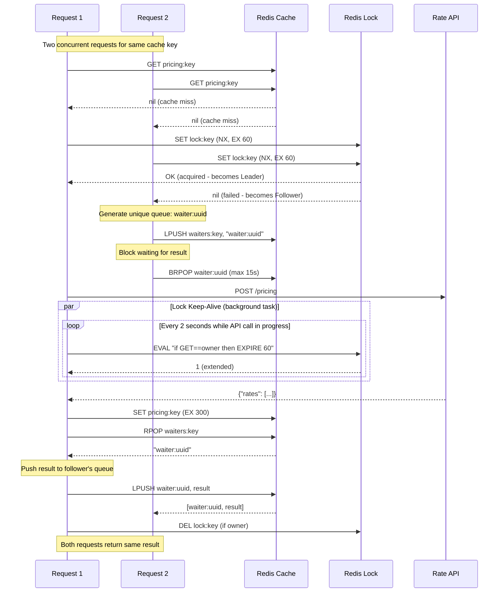

<div align="center">
   
</div>

# Backend Engineering Take-Home Assignment: Dynamic Pricing Proxy

## The Challenge

At Tripla, we use a dynamic pricing model for hotel rooms. Instead of static, unchanging rates, our model uses a real-time algorithm to adjust prices based on market demand and other data signals. This helps us maximize both revenue and occupancy.

Our Data and AI team built a powerful model to handle this, but its inference process is computationally expensive to run. To make this product more cost-effective, we analyzed the model's output and found that a calculated room rate remains effective for up to 5 minutes.

This insight presents a great optimization opportunity, and that's where you come in.

### Your Mission

Your mission is to build an efficient service that acts as an intermediary to our dynamic pricing model. This service will be responsible for providing rates to our users while respecting the operational constraints of the expensive model behind it.

### Core Requirements

1. **Integrate the Pricing Model**: Modify the provided service to call the external dynamic pricing API to get the latest rates. The model is available as a Docker image: [tripladev/rate-api](https://hub.docker.com/r/tripladev/rate-api).

2. **Ensure Rate Validity**: A rate fetched from the pricing model is considered valid for 5 minutes. Your service must ensure that any rate it provides for a given set of parameters (`period`, `hotel`, `room`) is no older than this 5-minute window.

3. **Honor API Usage Limits**: The model's API token is limited. Your solution must be able to handle at least 10,000 requests per day from our users while using a single API token for the pricing model.
---

## Solution Overview

This solution implements a dynamic pricing proxy service that efficiently caches and serves hotel room rates while respecting the operational constraints of the expensive upstream pricing model.

### Key Features

- **5-minute caching** - Rates are cached for exactly 5 minutes as required
- **Leader-Follower pattern** - Prevents duplicate API calls under concurrent load
- **No stale prices** - Only fresh cached data is served, never outdated prices

---

## Quick Start

### Prerequisites

- Docker and Docker Compose
- API Token (provided separately)

### 1. Configure Environment

```bash
# Copy the example environment file
cp .env.example .env

# Edit .env and add your API token
# API_TOKEN=your_token_here
```

### 2. Start the Service

```bash
# Start all services (app, rate-api, redis)
docker compose up --build
```

### 3. Test the Endpoint

```bash
curl 'http://localhost:3000/pricing?period=Summer&hotel=FloatingPointResort&room=SingletonRoom'
```

Expected response:
```json
{"rate":"23400"}
```

### 4. Run Tests

```bash
# Build the test image
docker build -t interview-app .

# Run the full test suite
docker run --rm -v $(pwd):/rails interview-app ./bin/rails test

# Run specific test files
docker run --rm -v $(pwd):/rails interview-app ./bin/rails test test/controllers/pricing_controller_test.rb
docker run --rm -v $(pwd):/rails interview-app ./bin/rails test test/services/leader_follower_cache_test.rb
```

---

## API Reference

### GET /pricing

Fetches the current rate for a hotel room.

**Parameters:**

| Parameter | Required | Valid Values                                              |
| --------- | -------- | --------------------------------------------------------- |
| `period`  | Yes      | `Summer`, `Autumn`, `Winter`, `Spring`                    |
| `hotel`   | Yes      | `FloatingPointResort`, `GitawayHotel`, `RecursionRetreat` |
| `room`    | Yes      | `SingletonRoom`, `BooleanTwin`, `RestfulKing`             |

**Success Response (200):**
```json
{"rate":"23400"}
```

**Error Responses:**

| Status | Description                             |
| ------ | --------------------------------------- |
| 400    | Missing or invalid parameters           |
| 503    | Pricing service temporarily unavailable |
| 500    | Unexpected server error                 |

**Example Error:**
```json
{"error":"Invalid period. Must be one of: Summer, Autumn, Winter, Spring"}
```

---

## Design Decisions

### Problem Analysis

The challenge presents several constraints that guided the design:

1. **Expensive API calls** - The upstream pricing model is computationally expensive
2. **Rate validity** - Prices are valid for 5 minutes
3. **Rate limits** - Must handle 10,000+ requests/day with a single API token
4. **Reliability** - Service must handle slow or failing upstream API gracefully

### Approach Considered

I evaluated three approaches before settling on the final solution:

#### Approach 1: Rails Cache

**Pros:** 
- Simple to implement

**Cons:**
- Cache Stampede when timeout

#### Approach 2: Distributed Locking + Polling

```
Request → Check Cache → [Miss] → Try Lock → Call API → Cache → Release
                                    ↓
                              [Locked] → Poll cache every 100ms
```
Sample implementation: 
- [redis_cache.rb](https://github.com/shaolim/callapi/blob/main/redis_cache.rb)
- [pricing_service.rb](https://github.com/shaolim/callapi/blob/main/pricing_service.rb)

**Pros:** 
- Simple to implement

**Cons:**
- Inefficient polling wastes resources

#### Approach 3: Leader-Follower with distributed locking (Chosen)

```
Request → Check Cache → [Miss] → Try Lock
                                    ↓
                          [Leader] → Call API → Cache → Notify followers
                                    ↓
                          [Follower] → BRPOP (block efficiently)
```

**Pros:**
- Efficient waiting (no polling)
- Safe lock with ownership verification
- Auto-extending locks for slow APIs

### Why I Chose Approach 3

1. **Resource efficiency** - BRPOP eliminates polling; only leader calls API
2. **Handles 10,000+ requests** - With 5-minute cache TTL, each unique parameter combination needs at most 288 API calls/day (24h × 60min / 5min = 288)

> **POC Reference:** All three approaches were prototyped in a standalone proof-of-concept before implementing the final solution. See [github.com/shaolim/callapi](https://github.com/shaolim/callapi) for the detailed comparison, including the technical design document.

### Sequence Diagram

The following diagram illustrates how concurrent requests are coordinated using the leader-follower pattern:



**Key Points:**
- **Leader Election**: First request to acquire lock (`SET NX`) becomes leader
- **Lock Auto-Extension**: Background task extends lock every 2s using Lua script (checks ownership before extending)
- **Efficient Waiting**: Followers use `BRPOP` which blocks without CPU usage (max 15s)
- **Direct Notification**: Leader pushes result directly to each follower's queue
- **Follower Timeout**: If follower times out after 15s, returns 503 error (no stale prices served)

### Architecture

```
┌─────────┐     ┌─────────────────────────────────┐     ┌──────────┐
│ Client  │────▶│  Rails App (PricingController)  │────▶│  Redis   │
└─────────┘     └─────────────────────────────────┘     │  Cache   │
                              │                         └──────────┘
                              │
                              ▼
                    ┌─────────────────┐
                    │    rate-api     │
                    │  (pricing model)│
                    └─────────────────┘
```

### Component Overview

| Component             | Responsibility                        |
| --------------------- | ------------------------------------- |
| `PricingController`   | Request validation, error handling    |
| `PricingService`      | API integration, cache key generation |
| `LeaderFollowerCache` | Coordination and caching logic        |
| `DistributedLock`     | Redis-based lock with auto-extension  |
| `AsyncRequest`        | Follower wait mechanism using BRPOP   |

### Configuration

| Constant             | Value        | Rationale                          |
| -------------------- | ------------ | ---------------------------------- |
| Cache TTL            | 300s (5 min) | Per requirements                   |
| Follower timeout     | 15s          | User-friendly wait time            |
| Lock TTL             | 60s          | Accommodates slow APIs             |
| Lock extend interval | 2s           | Keeps lock alive during long calls |

**Why follower timeout (15s) < lock TTL (60s)?**
- Lock TTL is a crash safety mechanism — needs buffer for retries and renewals
- Follower timeout is user-facing — fail fast rather than wait 60s for a crashed leader
- The 2s extend interval allows ~30 renewal attempts before lock expires

---

## Handling Failure Scenarios

### Scenario 1: Slow API Response

The distributed lock auto-extends every 2 seconds, allowing API calls up to 60 seconds without losing the lock. Followers wait up to 15 seconds for leader to complete.

### Scenario 2: API Returns Error

On API errors, the service returns a 503 error to the client. No stale prices are served to ensure data accuracy.

### Scenario 3: API Timeout

HTTP client timeouts protect against hanging connections. On timeout, a 503 error is returned.

### Scenario 4: Redis Unavailable

The service will fail gracefully with a 503 error. In production, Redis should be deployed with replication for high availability.

### Scenario 5: Leader Crashes Mid-Request

If the leader process crashes while fetching from the API:

1. **Followers timeout after 15s** → Return 503 error to users
2. **Lock auto-expires after 60s** → Allows new leader election

---

## Project Structure

```
dynamic-pricing/
├── app/
│   ├── controllers/
│   │   └── pricing_controller.rb       # Request handling and validation
│   └── services/
│       ├── pricing_service.rb          # Main service, API integration
│       ├── leader_follower_cache.rb    # Caching with coordination
│       ├── distributed_lock.rb         # Redis-based distributed lock
│       └── async_request.rb            # Follower wait mechanism
├── config/
│   └── routes.rb                       # GET /pricing endpoint
├── test/
│   ├── test_helper.rb                  # Test configuration and MockRedis
│   ├── controllers/
│   │   └── pricing_controller_test.rb  # Controller unit tests
│   ├── integration/
│   │   └── pricing_flow_test.rb        # End-to-end integration tests
│   └── services/
│       ├── async_request_test.rb       # AsyncRequest unit tests
│       ├── distributed_lock_test.rb    # DistributedLock unit tests
│       ├── leader_follower_cache_test.rb # Cache unit tests
│       └── pricing_service_test.rb     # PricingService unit tests
├── docker-compose.yml                  # Full stack: app, rate-api, redis
├── Dockerfile
├── Gemfile
└── .env.example
```

---

## Development

### Running Locally with Docker Compose

```bash
# Start with live reload
docker compose up --build

# View logs
docker compose logs -f

# Stop services
docker compose down
```

### Running Tests

```bash
# Build image
docker build -t interview-app .

# Run all tests
docker run --rm -v $(pwd):/rails interview-app ./bin/rails test

# Run specific test file
docker run --rm -v $(pwd):/rails interview-app ./bin/rails test test/controllers/pricing_controller_test.rb
```

### Environment Variables

| Variable       | Description                       | Default                        |
| -------------- | --------------------------------- | ------------------------------ |
| `API_TOKEN`    | Token for rate-api authentication | (required)                     |
| `REDIS_URL`    | Redis connection URL              | `redis://localhost:6379`       |
| `RATE_API_URL` | Rate API endpoint                 | `http://rate-api:8080/pricing` |

---

## Future Improvements

1. **Metrics and monitoring** - Track cache hit rates, API latency, and request patterns
2. **Health endpoint** - Add `/health` endpoint for load balancer health checks
3. **Redis failure resilience** - Add retry logic and graceful fallback when Redis goes down during lock renewal. Currently, a transient Redis failure crashes the renewal task while work continues, risking two processes holding the lock simultaneously when Redis recovers
